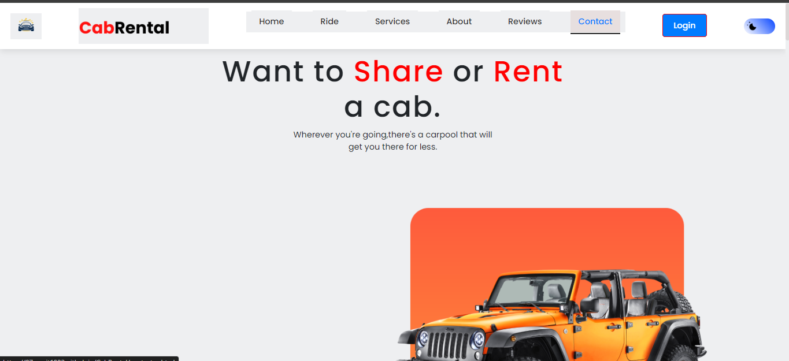
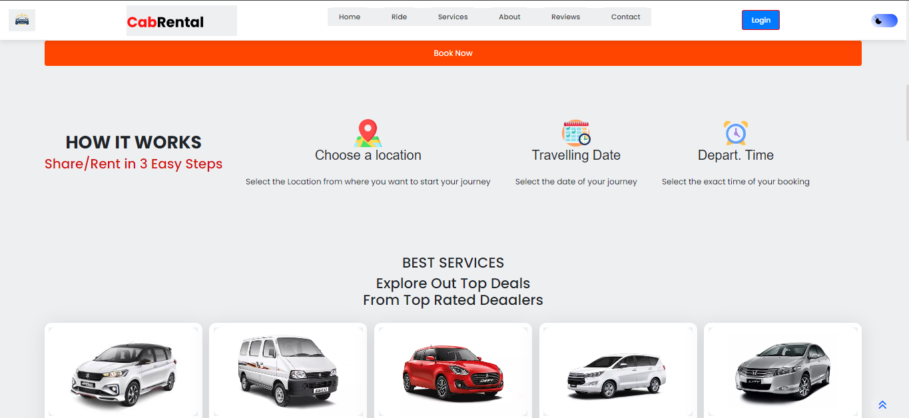

# 🚖 **CabRental**

🚗 CabRental is a **decentralized vehicle rental platform** using **Web3** for enhanced privacy, security, and flexibility. With crypto-wallet authentication 🔐 and smart contract-based transactions 📜, it offers a seamless, transparent, and tamper-proof rental experience.


<table align="center">
    <thead align="center">
        <tr border: 2px;>
            <td><b>🌟 Stars</b></td>
            <td><b>🍴 Forks</b></td>
            <td><b>🐛 Issues</b></td>
            <td><b>🔔 Open PRs</b></td>
            <td><b>🔕 Close PRs</b></td>
        </tr>
     </thead>
    <tbody>
         <tr>
            <td></td>
             <td></td>
            <td></td>
            <td></td>
           <td></td>
        </tr>
    </tbody>
</table>

---



---
## 📝 **Table of Contents**

- 🌟 [Features](#-features)
- 💻 [Technologies Used](#-technologies-used)
- 🔧 [Installation](#-installation)
- 🛠 [Web3 Integration Guide](#-web3-integration-guide)
- 📚 [Usage](#-usage)
- 🤝 [Contributing](#-contributing)
- 📄 [License](#-license)
- 📫 [Contact](#-contact)

---

## 🌟 **Features**

| Feature                         | Description |
|----------------------------------|-------------|
| **Decentralized Login** 🔐       | Secure login using MetaMask or any Web3-compatible wallet. |
| **Smart Contract Payments** 💰   | Rental payments and refunds are handled via Ethereum smart contracts for full transparency. |
| **Vehicle Search & Booking** 🚗  | Search for vehicles by location and type with real-time availability. |
| **Admin Dashboard** 👨‍💼          | Admins can manage all bookings, view usage analytics, and verify transactions. |
| **Notifications & Alerts** 🔔   | Get email, SMS, and on-chain notifications for bookings and payments. |
| **User Feedback & Reviews** ⭐  | Transparent, immutable, and decentralized reviews stored on the blockchain. |

Include feature-related visuals here:
- **Vehicle Search Example:** A screenshot showing how a user searches for vehicles.
- **Smart Contract Payments:** A diagram showcasing the blockchain interaction for payment processing.

---

## 💻 **Technologies Used**

| **Frontend**             | **Backend**            | **Blockchain**           | **Database**     |
|--------------------------|------------------------|--------------------------|------------------|
| HTML, CSS, JavaScript     | Node.js, PHP           | Solidity, Web3.js, Ethers.js | MySQL           |
| Bootstrap                 | Express.js             | MetaMask Integration      |                  |

---

## 🔧 Installation

Follow these steps to set up a local copy of CabRental:

### 1. Clone the Repository

```bash
git clone https://github.com/07sumit1002/CabRental.git
```

### 2. Navigate to the Project Directory

```bash
cd CabRental
```

### 3. Install Dependencies

  ```bash
  npm install composer
  ```

### 4. Set Up MetaMask for Wallet Login

- Ensure that you have the MetaMask extension installed in your browser for decentralized login functionality.
- Run the application

### 5. Configure the Environment

- **Server Requirements:**  
  Ensure your server supports PHP and Node.js.

- **Database Setup:**  
  Set up the MySQL database and configure the connection details as specified in the `config` file.

- **Blockchain Connection:**  
  Configure blockchain connection settings in the `config` file to interact with the smart contracts.

### 6. Run the Application

- **Using a Local Server:**  
  Open the project in your preferred web server (e.g., XAMPP, WAMP, or a Node.js server).

- **Access the Application:**  
  Navigate to `http://localhost/CabRental` (or your configured local server URL) in your web browser.
## 🛠 **Web3 Integration Guide**

### **Smart Contracts**

- Written in **Solidity** to handle booking agreements, payments, and refunds automatically.
- Deployed on **Ethereum** for enhanced security.

### **Blockchain Transactions**

- Wallet authentication via **MetaMask** allows decentralized login.
- **Web3.js** and **Ethers.js** are used to interact with the smart contracts for seamless blockchain operations.

---

## 📚 **Usage**

### **User Registration & Authentication:**

- Users can register via social media or crypto wallets like **MetaMask** for enhanced security.
---

### **Search and Book a Vehicle:**

- Use the search feature to find available vehicles based on your location and preferences.
---

### **Manage Bookings:**

- View booking details and cancel or modify bookings with real-time updates on the blockchain.
---

### **Receive Alerts & Notifications:**

- Get notifications via **SMS**, **email**, and **on-chain updates** for bookings, payments, and cancellations.

---

### **Admin Dashboard:**

- Admins can manage all bookings, analyze platform usage, and verify blockchain transactions.
---

## 🤝 Contributing

Contributions are what make the open-source community such an amazing place to learn, inspire, and create. Any contributions you make are **greatly appreciated**.

### How to Contribute

1. **Fork the Project**  
   Click the **Fork** button at the top right of the repository page.

2. **Clone Your Fork**  
   ```bash
   git clone https://github.com/your-username/CabRental.git
   ```

3. **Create a New Branch**  
   ```bash
   git checkout -b feature/AmazingFeature
   ```

4. **Make Your Changes**  
   Implement your feature or bug fix.

5. **Commit Your Changes**  
   ```bash
   git add .
   git commit -m 'Add some AmazingFeature'
   ```

6. **Push to Your Fork**  
   ```bash
   git push origin feature/AmazingFeature
   ```

7. **Open a Pull Request**  
   Navigate to the original repository and open a pull request with a detailed description of your changes.

## Contributors 🤩


## 📄 License

This project is licensed under the [MIT License](LICENSE).

## 📫 Contact

For any inquiries or support, please contact:

- **Email:** sumitkumar101984@gmail.com
- **GitHub:** [@07sumit1002](https://github.com/07sumit1002)

---

## ⭐ Star the Repo!

If you find this project useful and would like to support the project, please consider giving it a ⭐ star on GitHub! Your support helps us grow and improve. Thank you! 🙌

### Keep learning and exploring! 🚀
